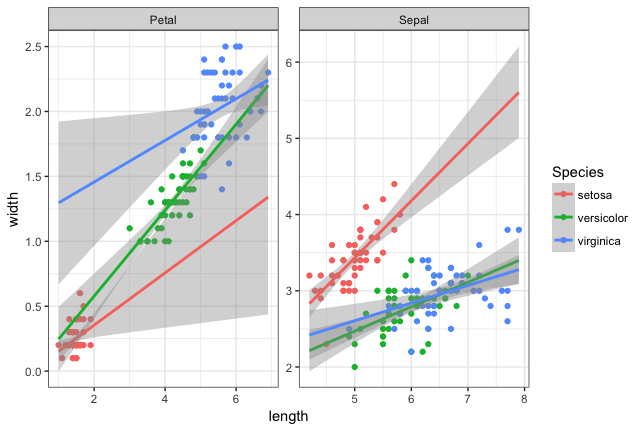

```{r setup, include=FALSE}
knitr::opts_chunk$set(echo = TRUE, cache=TRUE)
library(tidyverse)
```

##Homework 1 - to be done as groups
Names: Adrian Ramon Santonja, Jonas B H Andersen, Ismael Rodriguez Palomo, Steen J. Østergaard, Luiza Czerwinska.


Group: 3


For deadlines etc, see absalon. 

You have to supply botbh the answer (whatever it is: numbers, a table, plots or combinations thereof), as well as the R or Linux code you used to make the plots. This should be done using this R markdown template: we want both the R markdown file and a resulting PDF. For PDF output, you may have to install some extra programs - R studio will tell you. 

Note that:

1. If the R code gives different results than your results, you will get severe point reductions or even 0 points for the exercise

2. Some questions may request you to use R options we have not covered explicitly in the course: this is part of the challenge

3. While this is a group work, we expect that everyone in the group will have understood the group solution: similar or harder question might show up in the individual homework. So, if something is hard, it means you need to spend more time on it

4. The results should be presented on a level of detail that someone else could replicate the analysis. 

For statistical tests, you have to:

1) Motivate the choice of test 

2) State exactly what the null hypothesis is (depends on test!)

3) Comment the outcome: do you reject the null hypothesis or not, and what does this mean for the actual question we wanted to answer (interpretation)?


###Question 1
Install the package babynames and look at the data babynames:

```{r, eval=FALSE}
install.packages("babynames")
```
```{r q1.part1}
library(babynames)
head(babynames)
```

a) List the top 5 female baby names starting with P, regardless of year, as a table. 

```{r}
filter(babynames, str_detect(name, "^P"), sex=='F' ) %>% 
  group_by(name) %>% 
  summarise(count = sum(n)) %>% 
  arrange(desc(count)) -> tableQ1
tableQ1[1:5,]
```


b) Using the results from a, plot their occurrences as a function of year using a line plot.  Comment on your results. If you get strange results, explain them and/or improve the plot.

```{r}
P_names_full<-filter(babynames, name %in% tableQ1$name[1:5], sex=='F')

ggplot(P_names_full)+geom_line(data=P_names_full, mapping = aes(x=year, y=n, col=name))

```

We think that we do not see any strange result because since we saw that some of the names correspond to both male and female, we have already filter by 'sex=F' and thus, the 'strange lines' disapeared. 


##Question 2
In the same dataset, is the name Arwen significantly more (or less) common in 2004 vs 1990? Is the change significant? What is the likely cause? Do not use hard-coding. 

```{r}
name_filter = 'Arwen'
year1='1990'
year2='2004'

arwen_name<-filter(babynames, name==name_filter)
ggplot(arwen_name)+geom_line(arwen_name, mapping = aes(x=year, y=n))+ylab('Number of times Arwen has been used')+ggtitle('Number of times Arwen has been used each year')

arwen_1990<-filter(babynames, name==name_filter, year==year1)$n
arwen_2004<-filter(babynames, name==name_filter, year==year2)$n

no_arwen_2004<-filter(babynames, name!=name_filter, year==year2)
n_no_arwen_2004<-sum(no_arwen_2004$n)

no_arwen_1990<-filter(babynames, name!=name_filter, year==year1)
n_no_arwen_1990<-sum(no_arwen_1990$n)

table_names<-matrix(c(arwen_1990, n_no_arwen_1990, arwen_2004, n_no_arwen_2004), nrow = 2)
rownames(table_names)<-c('Arwen', 'No Arwen')
colnames(table_names)<-c(year1, year2)
chisq.test(table_names)
```

We use the Chi squared test, since we want to test proportions on counts and due to the high values contingency table cells have. The null hypothesis is there is no relation between row and columns, i.e. there is no relation beween number of babies named Arwen and the year.

With a p-value < 2.2e-16, we can reject the null hypothesis. Arwen is the name of one of the characters from
"The Lord of The Rings" trilogy, which last film was released in 2003. It is likely that the popularity of the
name Arwen increased after this release, given the huge popularity of the trilogy.


##Question 3
Produce the following plot starting from the flowers dataset. A potentially useful function that you may not have seen: bind_rows():  merges two tibbles by rows so that the joint tibble  becomes longer, not wider

For the exercise we will transform the dataset so that we will only have "width" and "length" features plus an extra one called "category" which can take values "Sepal" or "Petal" and will indicate to which part of the flower the width and length reffers to. To do that we first split the original dataset into one for petal features and one for sepal features using "transmutate", then they must be joined using "bind_rows()". Finally the plot is made splitting by "category" with "facet_wrap" and include the plot layers, "geom_point" for the scatter plots and "geom_smooth" for the linear model regression with a range (light grey shade).

```{r}
data_flowers <- read_tsv("data/flowers.txt")

flowers_petal <- transmute(data_flowers,  length = data_flowers$Petal.Length, 
                           width = data_flowers$Petal.Width, Species = 
                            as.factor(data_flowers$Species), category = "Petal")

flowers_sepal <- transmute(data_flowers, length = data_flowers$Sepal.Length, 
                           width = data_flowers$Sepal.Width, Species = 
                           as.factor(data_flowers$Species), category = "Sepal")

flowers_exp <- bind_rows(flowers_petal, flowers_sepal)

flowers_exp %>% ggplot(aes(x=length, y=width, col = Species)) +  geom_point() + 
  facet_wrap(~category, scales = "free") + theme_bw() + geom_smooth(method = "lm", 
                                                                    fullrange = TRUE)
```
=======


##Question 4
We are given a file with binding sites of a certain transcription factor, made with the ChIP-seq technique (you will hear a lot more about the technique later in the course) by a collaborator. 
In the homework directory, there is a data file 'chip_mm5.txt' from the collaborator, representing binding sites from a Chip-chip experiment, with a column for  chromosome, start, end, and score, where score is how 'good' the binding is. Our collaborator has two hypotheses:

1: Binding scores are dependent on chromosome

2: Binding site widths (end-start) are dependent on chromosome

Can you prove/disprove these two hypotheses statistically?


We first collect data from the Chip-chip experiment

```{r, eval=TRUE}
 
chip<-read_tsv("data/chip_mm5.txt") #read data
head(chip) #show data

```

In order to assertain which test to utilize, we plot the score in a historgram to see whether we can observe a normal distibution of the data.

```{r, eval=TRUE}
 
ggplot(chip) + geom_histogram(aes(x=score),binwidth = 20) + facet_wrap(~chr) + theme_bw()
# plot distribution of scores across each chromosome

```

The 5 removed rows were NA's.

We observe a normal distribution of score in each chromosome. In order to test whether there is a significant difference in binding score in the chromosomes, we utilize an one-way ANOVA test.
H0: there is no significant difference in means of binding score for each chromosome. 
H1: there is a significant difference in means of binding score for each chromosome. 

```{r, eval=TRUE}

oneway.test(score ~ as.factor(chr), data=chip)
#Anova test for significance difference between score values across chromosomes

```


We cannot reject our null hypothesis since the calculated p-value > 0.05, therefore we do not observe that there is a difference in mean binding score across chromosomes.

To test the other hypothesis, we need to modify our data set to include binding site width.

```{r, eval=TRUE}

new_chip<-mutate(chip, site.width = end - start) #create site.width (end - start)
head(new_chip) #new data

```

We plot the binding site width in a histogram to ascertain whether the data is normally distributed

```{r, eval=TRUE}

ggplot(new_chip) + geom_histogram(aes(x=site.width),binwidth = 50) + facet_wrap(~chr) + theme_bw()
# plot distribution of site width across each chromosome. Not a normal distribution

```

The binding site width is not normal distributed in the chromosomes. We utilize a Kruskal-Wallis test to test our null hypothesis.
H0: there is no significant difference in the mean binding site width for each chromosome. 
H1: there is a significant difference in the mean binding site width for each chromosome. 

```{r}

kruskal.test(site.width ~ as.factor(chr), data=new_chip)
#Kruskal test for significance difference between site width across chromosomes

```

Calculated p-value < 0.05 therefore we can reject our null hypothesis. The alternative hypothesis is proven and there is a significant difference in binding site width across the chromosomes.


