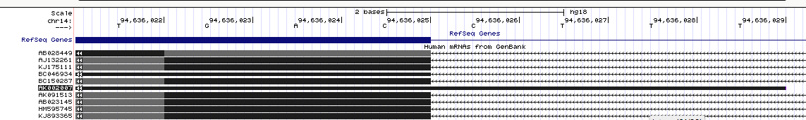
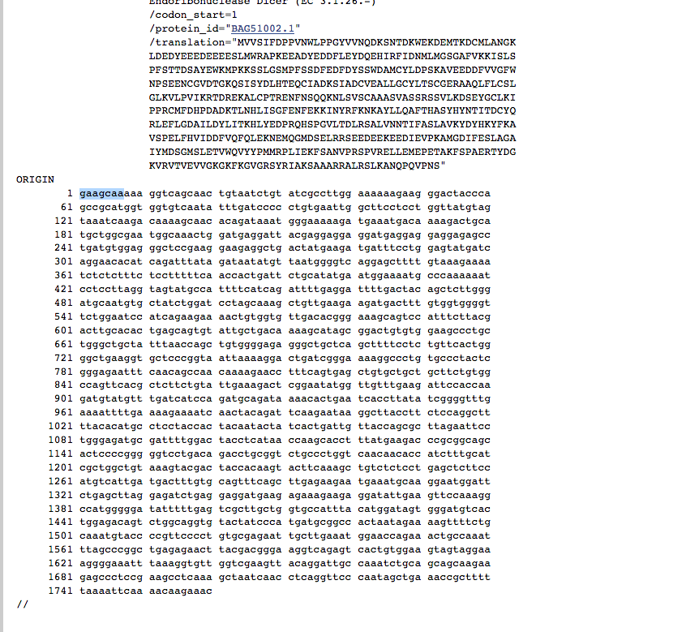
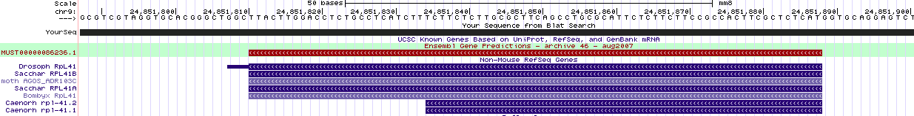
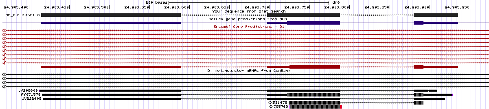
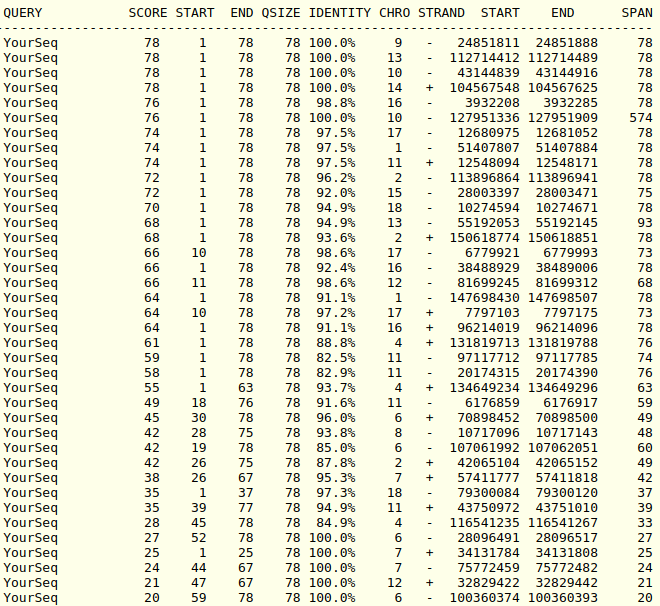
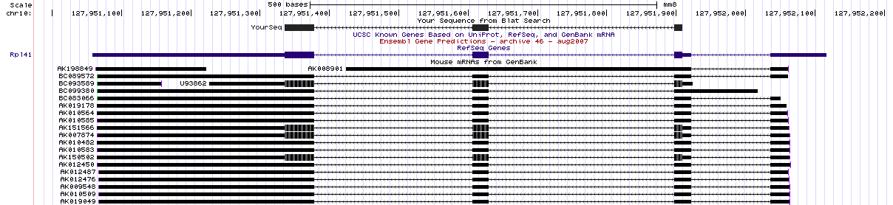
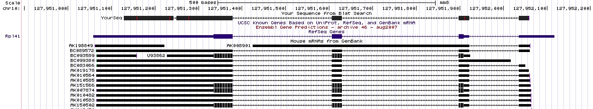

```{r setup, include=FALSE}
knitr::opts_chunk$set(echo = TRUE)
library(tidyverse)
#setwd("~/Dropbox2/Dropbox/TEACHING/BOHTA2018/homework1-3/hw2")
# change as appropriate
```
##Home work 2 - to be done as groups
Names: 
Group:

For deadlines etc, see Absalon.


###Question 1: Dicer dissected
The human DICER1 gene encodes an important ribonuclease, involved in miRNA and siRNA processing. Several mRNAs representing this gene have been mapped to the human genome (March 2006 assembly). We will look closer at one of them with the accession number AK002007.

a) What are the first five genomic nucleotides that are read by RNA polymerae II from this transcript? 

**Answer: **
The first 5 genomic nucleotides seen from the UCSC-genome browser is: 
*AAAGG*

This is seen on the following screenshot (Fig 1.) with the first exon starting on the right and running to the left. The sequence CCTTT is reserve complemented and gives AAAGG.




b) Look at the raw mRNA sequence of AK002007, from the database it actually comes from. What are the first five nucleotides? 

The first 5 nucleotides from the GenBank sequence is gaagcaa. This is seen in the screenshot on figure 2:



c) How do you explain the discrepancy (maximum 5 lines)?

The discrepancy is hard to explain, but we have a couple of theories. 
Looking at the GenBank entry we can see that the sequences are found by oligo-capping. In this method a cDNA library is constructed by removal of the 5'-Cap and insertion of a small synthetic oligo. This sequence could also show up in the sequencing and shown in the genbank, but removed when aligned to the genome

*Source: 1. Suzuki, Y., Yoshitomo-Nakagawa, K., Maruyama, K., Suyama, A. & Sugano, S. Construction and characterization of a full length-enriched and a 5’-end-enriched cDNA library. Gene 200, 149–156 (1997).*


###Question 2: ERA and ERB

Our collaborators designed a ChIP study using so-called tilling arrays (an outdated technique these days, but the top of the pop at the time: see http://en.wikipedia.org/wiki/Tiling_array): one for estrogen receptor alpha (ERA), one for estrogen receptor beta (ERB). All the sites are stored in BED files respectively for two ERs. These are now available in the homework directory, and are both mapped on hg18 genome. The current situation is that we know to some degree what ERA does, but not what ERB does (there are some evidence that they share some functions, but not all). So, we need bigger experiments and better statistics. 

a) 
Using BEDtools within Linux: What is the genome coverage (% of base pair covered at each chromosome) for ERB and ERA sites? If you need a file with chromosome sizes for hg18, it included in the assignment: hg18_chrom_sizes.txt. Plot the fractions for all chromosomes as a single barplot in R. Briefly comment the results. Is there anything particularly surprising? Try to explain the outcome (biological and/or experimental setup explanations)?

b) 
Again, using BEDtools in Linux:  How many ERA sites do/do not overlap ERB sites, and vice versa? Show the Linux commands and then a Venn diagram summarizing the results.  The Venn diagram can be made in R using one of many venn diagram packages, but you can also make it in any drawing program. 


###Question 3: Ribosomal Gene (*)

Your group just got this email from a frustrated fellow student:

My supervisor has found something he thinks is a new ribosomal protein gene in mouse. It is at chr9:24,851,809-24,851,889, assembly mm8. His arguments for this are
a) It has high conservation in other species because ribosomal protein genes from other species map to this mouse region
b) And they are all called Rpl41 in the other species (if you turn on the other Refseq you see this clearly in fly and other species).

But, I found out that if you take the fly refseq sequence mentioned above (from Genbank) and BLAT this to the fly genome, you actually get something that looks quite different from the one in the mouse genome. How can this be? Is the mouse gene likely to be real? If not, why? (Maximum 20 lines, plus possibly genome browser pictures)

**Answer:**

This is the genomic region in mouse in which we can see that there is a conserved gene in fly and some other species, all of them ribosomal proteins (RpL41).



We can see that the mRNA from the gene we are looking for does not seem to be spliced, but when we take the sequence from the fly and BLAT it against its own genome, we get that the mRNA from gene we find (RpL41) is spliced here, while was not in the possible gene from mouse.



In order to find out a reason for that, we took the mouse genomic sequence and BLAT against the mouse genome (mm8). These are the hits we got:



We observe that the same phenomenon, is happening in multiple places in different chromosomes. Now focusing on the sixth hit, we see that the span (574) is significantly higher than in the others (78). If we go to the genome browser for that region, we can see that there is an actual RefSeq gene there, a ribosomal protein.



We also took a extended sequence, 200 bp from both sides, and performed the BLAT alignment again, getting a longer alignment for the same ribosomal gene.



The explanation we have for this is that the original sequence in mouse is likely to be a processed retrotransposon. This could have happended due to a retro-transcription of the spliced mRNA of the actual ribosomic protein gene we found in mouse followed by an insertion in the genome. The fact that we found many identical sequences in the genome also supports this explanation.

From searching in literature we see that this is a very common phenomenon for ribosomic protein genes [1]. It has been long thought that this was junk DNA, but now it is being investigated wether these sequences could have some function [2]. In our own research, we observe a high conservation in these sequences and also some ESTs overlapping with the original sequence. Usually pseudogenes are not coding any protein but they might perform some function as RNA altering the expression.

References:

1. Zhang Z, Harrison P, Gerstein M. Identification and Analysis of Over 2000 Ribosomal Protein Pseudogenes in the Human Genome. Genome Research. 2002;12(10):1466-1482. doi:10.1101/gr.331902.

2. Pink RC, Wicks K, Caley DP, Punch EK, Jacobs L, Francisco Carter DR. Pseudogenes: Pseudo-functional or key regulators in health and disease? RNA. 2011;17(5):792-798. doi:10.1261/rna.2658311.


